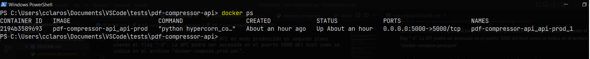
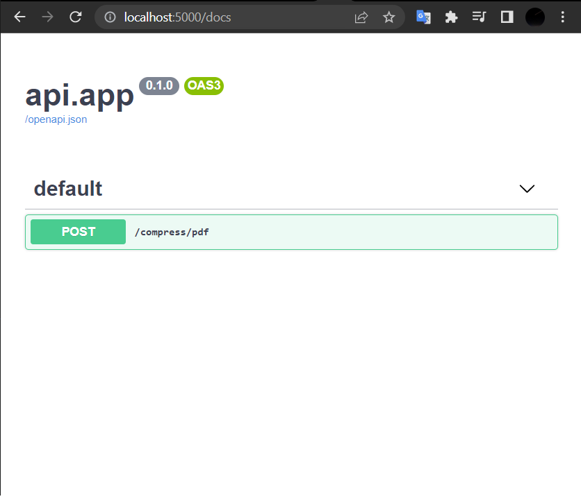
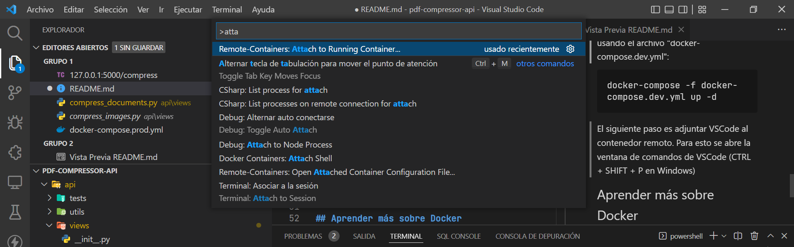
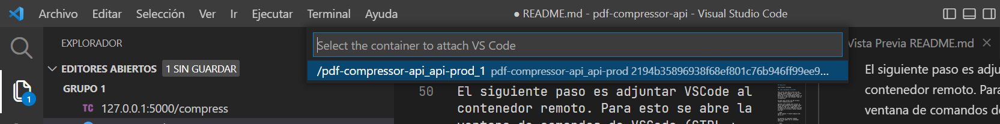
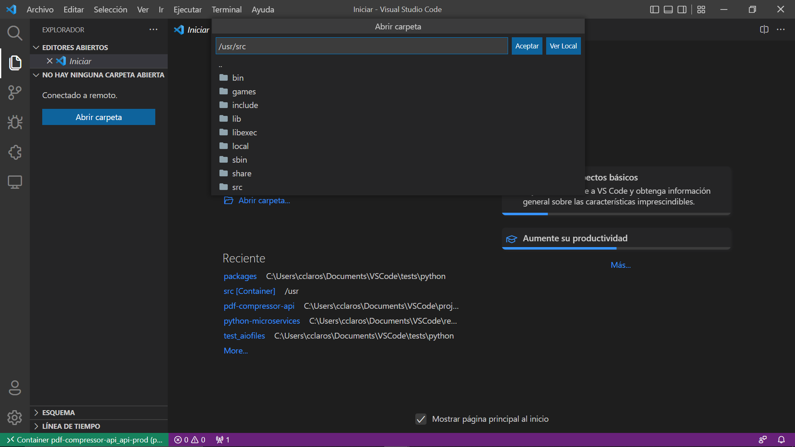
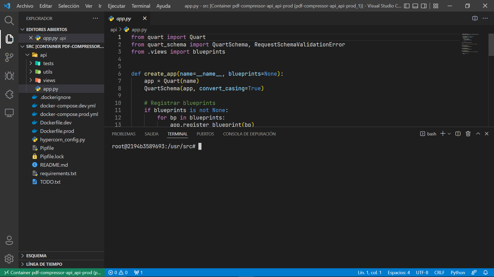

# API para procesar documentos

Por el momento esta API solo sirve para comprimir archivos PDF.

## Requisitos

Tener Docker instalado.

## ¿Cómo implementar esta API?

Para correr esta API se hace uso del comando "docker-compose", el cual sirve para definir y ejecutar aplicaciones Docker de varios contenedores apartir de un archivo ".yml" que contendrá toda la configuración.

En este caso se hará uso del archivo "docker-compose.prod.yml".

Ejecutar este comando para iniciar la API en modo producción en segundo plano usando el flag "-d". La API podrá ser accesada en el puerto 5000 del host como se indica en el archivo "docker-compose.prod.yml".

```bash
docker-compose -f docker-compose.prod.yml up -d
```

Si ejecutas el siguiente comando deberías de poder ver el contenedor corriendo.

```bash
docker ps
```

En este caso se observa que el puerto 5000 en el contenedor (5000/tcp) está siendo mapeado con el puerto 5000 del host (0.0.0.0:5000):



Para detener contenedores y eliminar contenedores, redes, volúmenes e imágenes creados por el anterior comando ejecutar:

```bash
docker-compose -f docker-compose.prod.yml down
```

Puedes acceder a la documentación de esta API en la ruta "/docs".


## ¿Cómo continuar con el desarrollo de esta API usando VSCode dentro de este contenedor?

Para esto se debe tener instalado VSCode y la extensión para VSCode "Remote - Containers".

En este caso se iniciará el contenedor usando el archivo "docker-compose.dev.yml":

```bash
docker-compose -f docker-compose.dev.yml up -d
```

El siguiente paso es adjuntar VSCode al contenedor remoto. Para esto se abre la ventana de comandos de VSCode (CTRL + SHIFT + P en Windows), se escribe "attach to running container" y se selecciona la opción que nos da la extensión "Remote-Containers".



Y se selecciona el contenedor.


Por último se selecciona el directorio de trabajo, el cual es "/usr/src" en el contenedor:


Y listo, ya se tendrá el mismo entorno de producción para desarrollo con las paqueterías cargadas.


## Aprender más sobre Docker

https://www.youtube.com/watch?v=3c-iBn73dDE&ab_channel=TechWorldwithNana
